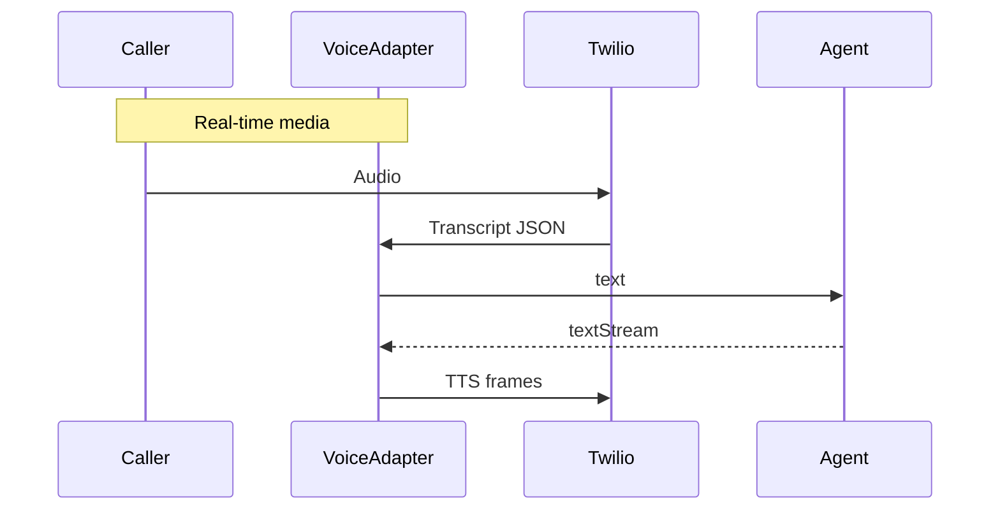

# Requirement CH-1.3 – Twilio Conversation Relay Voice Support

**Status:** ✅ Complete

---

## 1. User Story

> *“As a Voice developer, I get session continuity out of the box.”*

## 2. Objective

Implement the specifics needed for Twilio’s **Conversation Relay (media WebSocket)** to integrate with our channel abstraction.

## 3. Tasks

### 3.1 Metadata Extraction

- [x] `VoiceRelayAdapter.getSubjectMetadata` returns:
  ```ts
  { from: event.payload.from, callSid: event.payload.callSid }
  ```

### 3.2 WebSocket Flow

- [x] On `media` messages (audio → text), batch transcripts until silence or 500 ms pause, then call agent.
- [x] Stream agent text → TTS via `twilio/media-stream` JSON messages.

### 3.3 Heartbeat / Keep‐Alive

- [x] Respond to Relay ping frames.

### 3.4 Example Diagram



### 3.5 Tests

- [x] Mock Relay WS; assert TTS frames sent.

## 4. Acceptance Criteria

1. Voice calls round‐trip audio in <2 s latency.
2. Conversation continuity verified with same callSid.

## 5. Definition of Done

- [x] Tasks complete, end‐to‐end demo video.

---

*Channel module complete ⇒ move to Logging.* 