# Requirement CM-1.0 – Canonical `subjectId` & Conversation Continuity

**Status:** 🚧 In Progress

---

## 1. User Story

> *“As a developer, I want a user’s conversation to seamlessly continue whether they switch from SMS to a phone call (or any other channel), so the agent has full context.”*

## 2. Objective

Introduce a **canonical `subjectId`** that abstracts away channel-specific identifiers and allows the framework to map every inbound event (SMS, Voice, Web, …) to a single conversation state (OpenAI *RunState* string + human-readable history).

## 3. High-Level Design

```mermaid
sequenceDiagram
    participant SMS as SMS Adapter
    participant Voice as Voice Adapter
    participant SR as SubjectResolver
    participant CM as ConversationManager
    participant Persist as StatePersistence

    SMS->>SR: resolve({ from: "+14155550100" })
    SR-->>SMS: subjectId = "cust_123"
    SMS->>CM: loadContext(subjectId)
    CM->>Persist: getRunState(subjectId)
    Persist-->>CM: RunState string or Ø
    CM-->>SMS: CustomerContext
    Note over SMS: …process turn with OpenAI Agent…
```



* A new **`SubjectResolver`** plug-in point handles the mapping logic.
* **`ConversationManager`** becomes keyed by `subjectId` (not `sessionId`), enabling cross-channel continuity.
* The existing **`StatePersistence`** store is reused but files are renamed `<subjectId>.json`.
* **Default storage**: the bundled `StatePersistence` implementation persists **plain JSON files** in `./data/conversation-states/`, requiring no external services.
* **Pluggable choice**: swap in Redis, Postgres, etc. by providing another class that implements the same five async methods (`init`, `saveState`, `loadState`, `deleteState`, `cleanupOldStates`) and exporting it as `statePersistence`.

## 4. Detailed Task Checklist

Tick each box once the task has been completed & merged.

### 4.1  Domain Types & Interfaces

- [ ] Define `type SubjectId = string` in `src/types/common.ts`.
- [ ] Add **`interface SubjectResolver`** with method:
  ```ts
  resolve(raw: Record<string, any>): Promise<SubjectId>;
  ```
- [ ] Provide a **default implementation** `DefaultPhoneSubjectResolver` (maps E.164 phone → subjectId).

### 4.2  Conversation Manager (new file `src/conversation/manager.ts`)

- [ ] Create `ConversationManager` class (singleton) that:
  * Stores **one** `RunState` string **per** `subjectId`.
  * Persists state via `statePersistence.{loadState,saveState}`.
  * Exposes:
    ```ts
    async getContext(subjectId): Promise<CustomerContext>
    async saveContext(subjectId, ctx: CustomerContext, runState: RunState): Promise<void>
    async endSession(subjectId): Promise<void>
    ```
- [ ] Migrate existing in-memory `ContextManager` logic into the new manager or wrap it.

### 4.3  Channel Adapter Contract

- [ ] Extend `ChannelAdapter.send/receive` signatures to accept **`subjectResolver`**.
- [ ] Update **SMS** & **Voice** adapters to:
  1. Call `subjectResolver.resolve(rawChannelMetadata)`.
  2. Use returned `subjectId` when calling `ConversationManager`.

### 4.4  ThreadingService Integration

- [ ] Replace `conversationId` (currently CLI `sessionId`) with `subjectId` when caching `Runner`s & persisting state.
- [ ] Rename any persisted JSON files from `<conversationId>.json` → `<subjectId>.json` (migration helper acceptable).

### 4.5  Unit & Integration Tests

- [ ] Add Jest tests for `DefaultPhoneSubjectResolver` (same number across channels returns identical `subjectId`).
- [ ] Integration test: Simulate SMS then Voice turn → verify shared `RunState` and continuous history.

### 4.6  Docs & Examples

- [ ] Update README quick-start section with example curl for SMS + Voice showing continuity.
- [ ] Inline code sample for saving & loading run state (see § 5 below).

### 4.7  Tech Debt / Nice-to-Have

- [ ] Implement `cleanup(maxAgeMs)` helper on `ConversationManager`.
- [ ] Emit lifecycle events (`conversation_start`, `conversation_end`).

## 5. OpenAI Agents SDK Reference Snippets

```ts
import { RunState } from "@openai/agents";

// Serialize after each interruption / successful turn
await statePersistence.saveState(subjectId, result.state.toString());

// Later… resume exactly where we left off
const rs = await statePersistence.loadState(subjectId);
const input: RunState = await RunState.fromString(agent, rs as string);
const result = await runner.run(agent, input, { stream: true });
```

> ☝️ **Note:** `RunState.fromString` reconstructs **all** in-progress tool calls and model state. You **must** pass the same `Agent` instance used originally.

## 6. Acceptance Criteria

1. Switching from SMS to Voice (or vice-versa) with the same phone number continues the conversation *without losing context*.
2. Persisted state is cleaned up via `ConversationManager.endSession()` or `cleanup(maxAgeMs)`.
3. All new public APIs are fully typed and documented with TSDoc.
4. All unit & integration tests pass (`npm test`).

## 7. Definition of Done

- [ ] All checklist items complete.
- [ ] PR merged to `main` with green CI.
- [ ] Example scenario in README verified manually.

---

*When this document reaches ✅ **Done**, proceed to the next requirement (CM-1.1).* 